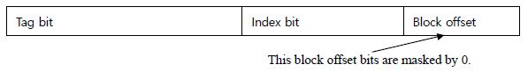
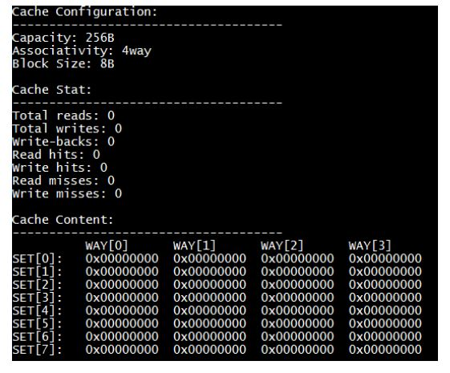

# Cache Design

## 개요

이 프로젝트는 data cache를 구현하여 캐싱의 원리를 이해하기 위한 것이다.

이 프로젝트의 주요 부분은 input trace 파일에서 데이터 cache를 시뮬레이션 하는 것이다.

이 프로젝트에서 cache는 command line 옵션으로 capacity, associativity, block 크기를 조절 할 수 있다.

## 사용된 환경 & version
- Ubuntu 18.04.1 LTS (64bit)
- gcc (Ubuntu 7.4.0-1ubuntu1~18.04.1) 7.4.0


## 사용 시 주의사항

**실행파일 생성 및 테스트**

```bash
make
make test
```

**생성 된 실행파일 삭제**

```bash
make clean
```


## 기능 설명

**Policy**
- 이 프로젝트에서 replacement policy는 LRU이다.

**Cache Parameters**

- 캐시의 capacity, associativity, block size를 조절 할 수 있다. 
- parameters는 '-c' 옵션으로 지정된다.
    - -c [capacity]:[assoc]:[blocksize]
        - Capacity: 4B (one word) ~ 8KB
        - Associativity: 1 ~ 16 way
        - Block size: 4B ~ 32B

**simulator option**

```bash
./sce212cache -c cap:assoc:block_size [-x] input_trace
```
- -c : cache 구성
- -x : 시뮬레이션이 끝날 때 cache 내용을 dump한다.


**cache 내용은 data 내용이 아니라 block size에 맞춰진 주소이다.**
- e.g.,) Block size 16B


**주소 0x10001234가 cache에 저장되면 cache 항목의 내용은 0x10001230이다.**
**4bit(block size bit)는 0으로 mask 된다.**



## 입력예시
- e.g)
- R 0xe44598
- R 0x4cb7a70
- R 0xe4459c
- R 0xe445a0
- R 0x4cb7a70
- R 0xe445a4
- ....


## 출력예시

